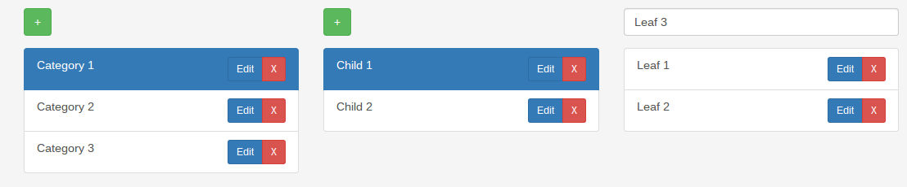

# Bootstrap Categories



A jQuery plugin for displaying and modifying categories and subcategories.
It can be used to display any data with a parent-child relationship.

[Demo](http://natzim.me/bootstrap-categories)

## Documentation

### Usage

```javascript
$element.categories(data, options);
```

`data` should be an array of objects.

Each object in `data` should have at least an `id` and `name` property.

If the object is a child of another category, it should have a `parent` property which contains the `id` of the parent object.

Example

```javascript
var data = [
	{
		id: 0,
		name: 'Category'
	},
	{
		id: 1,
		name: 'Child',
		parent: 0
	},
	{
		id: 2,
		name: 'Leaf',
		parent: 1
	}
];

var options = {
	selectClass: 'form-control'
};

$('#element').categories(data, options);
```

### Options

| Option                | Type   | Description                                    | Default                   |
| --------------------- | ------ | ---------------------------------------------- | ------------------------- |
| `selectClass`         | String | Class given to generated `<ul>` elements       | `'list-group'`            |
| `columnClass`         | String | Class given to generated columns               | `'col-sm-4'`              |
| `activeClass`         | String | Class given to the active category             | `'active'`                |
| `listItemClass`       | String | Class given to the list items                  | `'list-group-item'`       |
| `addButtonClass`      | String | Class given to the add category button         | `'btn btn-success'`       |
| `addButtonHtml`       | String | HTML injected into the add category button     | `'+'`                     |
| `removeButtonClass`   | String | Class given to the remove category button      | `'btn btn-sm btn-danger'` |
| `removeButtonHtml`    | String | HTML injected into the remove category button  | `'&times;'`               |
| `addInputClass`       | String | Class given to the ad category input           | `'form-control'`          |
| `addInputPlaceholder` | String | Placeholder to be given to the add input       | `'Category name'`         |
| `addable`             | Bool   | Should the user be able to add new categories? | `false`                   |
| `removable`           | Bool   | Should the user be able to remove categories?  | `false`                   |
| `maxLevels`           | Number | The maximum number of columns allowed          | `3`                       |

### Events

Events can be useful if the categories are being stored persistently, so you could send an AJAX request to the server when a new category is added to store it.

#### `onAdd`

Called when a new category is about to be added.

If you do not want the category to be added, make the function return `false`.

`object` refers to the category object that is about to be added.

```javascript
var options = {
	onAdd: function(category) {
		// Do something
	}
};
```

#### `onRemove`

Called when a category is about to be removed.

If you do not want the category to be removed, make the function return `false`.

`object` refers to the category object that is about to be removed.

```javascript
var options = {
	onRemove: function(category) {
		// Do something
	}
};
```

#### `onSelect`

Fired when a category is selected.

`object` refers to the selected category object.

```javascript
var options = {
	onSelect: function(category) {
		// Do something
	}
};
```
